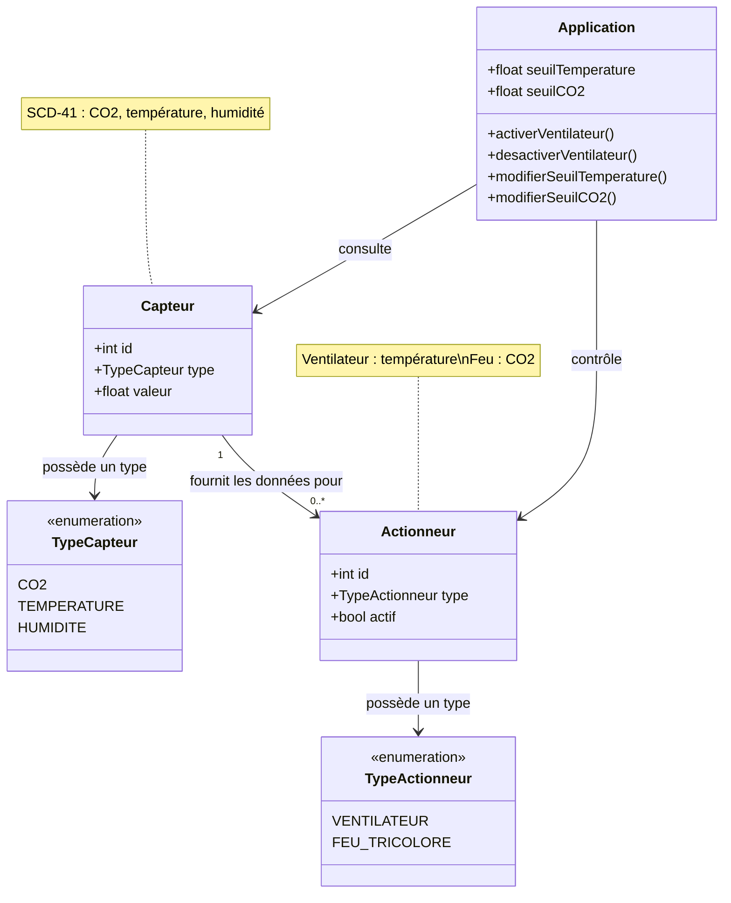

Diagramme de classe:

```mermaid
classDiagram

    class Capteur {
        +int id
        +TypeCapteur type
        +float valeur
    }

    class Actionneur {
        +int id
        +TypeActionneur type
        +bool actif
    }

    class Application {
        +float seuilTemperature
        +float seuilCO2
        +activerVentilateur()
        +desactiverVentilateur()
        +modifierSeuilTemperature()
        +modifierSeuilCO2()
    }

    class TypeCapteur {
        <<enumeration>>
        CO2
        TEMPERATURE
        HUMIDITE
    }

    class TypeActionneur {
        <<enumeration>>
        VENTILATEUR
        FEU_TRICOLORE
    }

    Capteur --> TypeCapteur : possède un type
    Actionneur --> TypeActionneur : possède un type

    Capteur "1" --> "0..*" Actionneur : fournit les données pour

    Application --> Capteur : consulte
    Application --> Actionneur : contrôle

    note for Capteur "SCD-41 : CO2, température, humidité"
    note for Actionneur "Ventilateur : température\nFeu : CO2"
```
