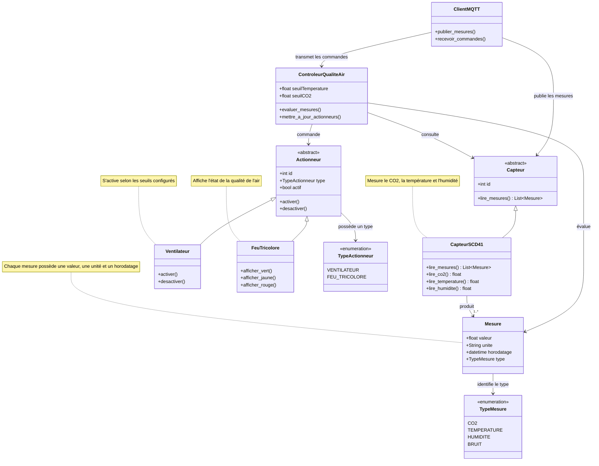

Diagramme de classe:

```mermaid
classDiagram

    class Capteur {
        <<abstract>>
        +int id
        +lire_mesures() List~Mesure~
    }

    class CapteurSCD41 {
        +lire_mesures() List~Mesure~
        +lire_co2() float
        +lire_temperature() float
        +lire_humidite() float
    }

    class Mesure {
        +float valeur
        +String unite
        +datetime horodatage
        +TypeMesure type
    }

    class Actionneur {
        <<abstract>>
        +int id
        +TypeActionneur type
        +bool actif
        +activer()
        +desactiver()
    }

    class Ventilateur {
        +activer()
        +desactiver()
    }

    class FeuTricolore {
        +afficher_vert()
        +afficher_jaune()
        +afficher_rouge()
    }

    class ControleurQualiteAir {
        +float seuilTemperature
        +float seuilCO2
        +evaluer_mesures()
        +mettre_a_jour_actionneurs()
    }

    class ClientMQTT {
        +publier_mesures()
        +recevoir_commandes()
    }

    class TypeMesure {
        <<enumeration>>
        CO2
        TEMPERATURE
        HUMIDITE
        BRUIT
    }

    class TypeActionneur {
        <<enumeration>>
        VENTILATEUR
        FEU_TRICOLORE
    }

    Capteur <|-- CapteurSCD41
    Actionneur <|-- Ventilateur
    Actionneur <|-- FeuTricolore

    CapteurSCD41 --> "1..*" Mesure : produit
    Mesure --> TypeMesure : identifie le type
    Actionneur --> TypeActionneur : possède un type

    ControleurQualiteAir --> Capteur : consulte
    ControleurQualiteAir --> Mesure : évalue
    ControleurQualiteAir --> Actionneur : commande

    ClientMQTT --> Capteur : publie les mesures
    ClientMQTT --> ControleurQualiteAir : transmet les commandes

    note for CapteurSCD41 "Mesure le CO2, la température et l'humidité"
    note for Ventilateur "S'active selon les seuils configurés"
    note for FeuTricolore "Affiche l'état de la qualité de l'air"
    note for Mesure "Chaque mesure possède une valeur, une unité et un horodatage"
```
